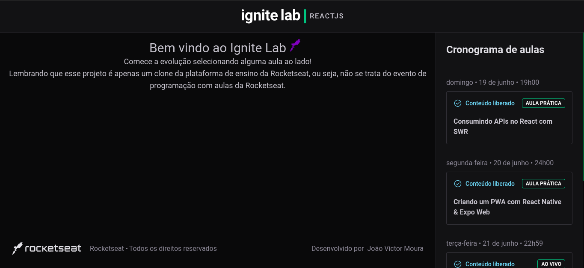

# Ignite Lab Clone

<p>
  🇺🇸 Clone Event Platform of <a href='https://github.com/Rocketseat' target='blank'>Rocketseat</a> made with ReactJS, TypeScript, GraphQL, GraphCMS, Vite and Tailwind.
</p>

<br/>

<p>
  🇧🇷 Clone da Plataforma de Eventos da <a href='https://github.com/Rocketseat' target='blank'>Rocketseat</a> feito com ReactJS, TypeScript, GraphQL, GraphCMS, Vite e Tailwind.
</p>

# 🇧🇷 A aplicação está on-line no link | 🇺🇸 The application is online at the link:


```

```

## 🇺🇸 If you want to analyze the project on your machine, follow this step by step. 🇧🇷 Caso você queira analisar o projeto em sua máquina, siga este passo a passo: 😁

<br>

## 🇺🇸 ENG

### Clone😎

```
git clone https://github.com/jovimoura/igniteLab-platform
```

### Access the folder🤓

```
cd <folder>
```
### Install dependencies🤠
```
npm install
```
### Start application🤩
```
npm run dev
```
### default port:🤗

```
http://localhost:3000/
```

<br>

## 🇧🇷 PT-BR

### Clone o repositório😎

```
git clone https://github.com/jovimoura/igniteLab-platform
```

### Acesse o diretorio🤓

```
cd <nome-da-pasta>
```
### Instale as dependências🤠
```
npm install
```
### Inicie a aplicação🤩
```
npm run dev
```
### A aplicação, por padrão, fica na porta:🤗

```
http://localhost:3000/
```

# .ENV

```
VITE_API_URL=
VITE_API_TOKEN=
```

## 🇺🇸 Image | 🇧🇷 Imagem do projeto 💻



## 🇺🇸 Responsive | 🇧🇷 Responsivo 📱


##  🇺🇸 Tecnologies and Libs | 🇧🇷 Tecnologias e Bibliotecas utilizadas🦉

<ul>
    <li>ReactJS</li>
    <li>TypeScript</li>
    <li>GraphQL</li>
    <li>GraphCMS</li>
    <li>Vite</li>
    <li>Tailwind</li>
    <li>Date-fns</li>
    <li>Phosphor-react</li>
</ul>

##  🇧🇷 Feito por | 🇺🇸 Made by:

### João Victor dos Santos Moura
### E-mail: joaovictors.mouraa@gmail.com
### Linkedin: https://www.linkedin.com/in/jovimoura10/
